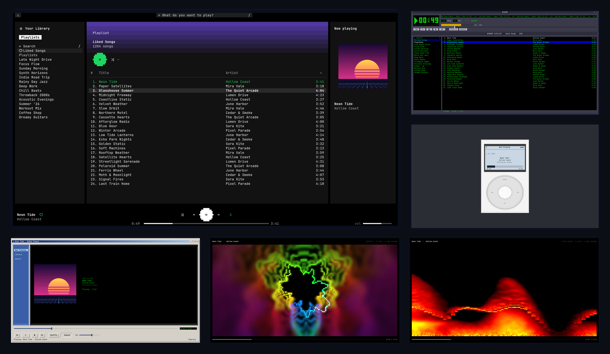
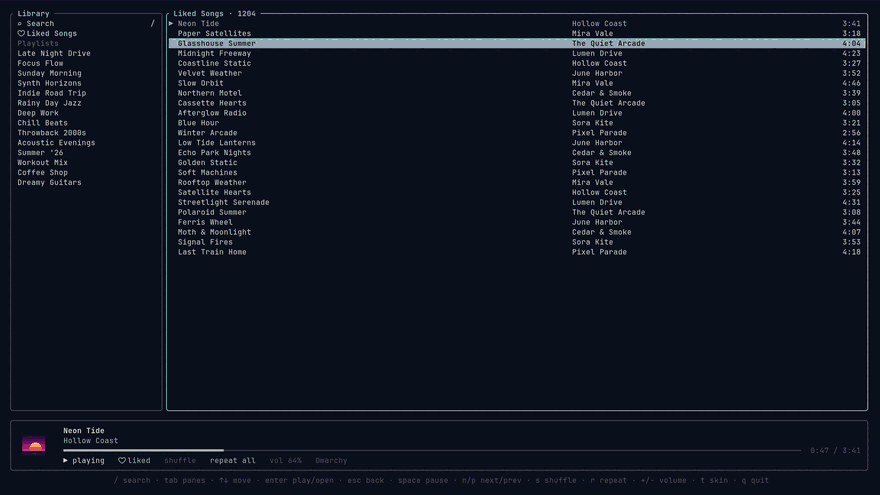

# Skinamp

**The Spotify player you can skin**, for [Omarchy](https://omarchy.org).
A music icon in your bar with a mini player on hover, and a fast terminal
player with eleven looks (your Omarchy theme, today's Spotify app, lyrics,
Winamp, iTunes, a click-wheel iPod, Zune, Windows Media Player 11 and 2000)
plus real visualizers, from
WMP-style bars and fire to full-resolution GPU shaders.

Built in Rust on [librespot](https://github.com/librespot-org/librespot):
no official Spotify app, no spotifyd, no cava, no Chromium. About 27 MB for
the background player and 20 MB for the player window. Apple Silicon
(Asahi) and x86_64.



<details><summary>Watch a tour of the skins (GIF, 3 MB)</summary>



</details>

## Install

```sh
omarchy plugin add https://github.com/idrewlong/skinamp --enable
```

Then hover the music icon in the bar and click **Set up**. A terminal shows
the install (prebuilt binaries for your machine, checked against the
release's checksums; built from source if there's no release for it), then
your browser opens to sign in to Spotify. That's it.

**Requirements:** Omarchy 4 and Spotify Premium (Spotify's rule for
third-party playback). Nothing else to install: audio goes through
PipeWire's PulseAudio support, which Omarchy has. Building from source (only
when there's no release for your CPU) needs Rust.

## Use it

- **Bar icon:** hover for the mini player (cover, progress, shuffle,
  previous, play/pause, next, repeat, ♥ like); click to open the player;
  middle-click plays/pauses; scroll skips.
- **Player** (also **Skinamp** in the app launcher): your library,
  playlists (most recently played first, like Spotify) and search. `t`
  steps through the skins and every visualizer, `T` goes back. Space
  plays/pauses, `n`/`p` skip, `f` likes, `/` searches, `?` lists every key for the
  skin you're in.
- **Lyrics:** a skin of its own. Synced lyrics follow the song, the
  current line highlighted in the middle; click a line to jump there.
  From [LRCLIB](https://lrclib.net), the open lyrics database; also
  `skinamp lyrics` in a terminal.
- **Visualizers:** seven terminal styles (bars, mirror, scope, fire storm,
  musical colors, alchemy, battery), then five GPU presets (battery,
  alchemy, spectrum, ambience, warp) drawn in full resolution right in the
  player in terminals that show images (foot, Omarchy's default, does).
  `V` opens them in a window of their own (`f` for fullscreen), as does
  the Visualizer button in the bar icon's card.
- **Volume** is your system volume: the bar's slider and the player agree.
- Notifications on track changes; click one to open the player. Media keys
  and anything else that speaks MPRIS work too.

## Make it yours

- `~/.config/skinamp/tui.toml`: default skin, visualizer,
  playlist order, colors, layout (see [`examples/tui.toml`](examples/tui.toml)).
- `~/.config/skinamp/config.toml`: device name, bitrate,
  notifications.
- Your own visualizers: a WGSL file in `~/.config/skinamp/viz/`
  (start from [`examples/viz/ring.wgsl`](examples/viz/ring.wgsl)). It shows
  up among the GPU presets and reloads each time you save.
- Artists, albums and playlists in search results: add your own
  [Spotify developer app](https://developer.spotify.com/dashboard) (redirect
  URI `http://127.0.0.1:8989/login`) with `skinamp login-app
  <client-id>`. Optional: without it your playlists, Liked Songs, albums and
  song search come through the player's own Spotify connection. With it,
  the rate limit is yours alone, not shared with every other user.

## Try it without an account

`skinamp tui --demo` opens the player with made-up music (no
daemon, no sign-in): press `t` to go through every skin and visualizer.
The preview above is demo mode.

## Update

`omarchy plugin update io.github.idrewlong.skinamp`, then
**Update** in the bar icon's card. What was playing carries on.

## Remove

```sh
~/.config/omarchy/plugins/io.github.idrewlong.skinamp/scripts/uninstall.sh
omarchy plugin remove io.github.idrewlong.skinamp
```

The first command stops and removes the player, its service, launcher
entries and window rules; add `--purge` to also delete your sign-in, cache
and settings.

## What the installer does

Everything goes in your home folder; nothing needs `sudo` and no system
packages are installed or changed. **Set up** (or `scripts/install.sh`):

1. Downloads the release for your CPU from this repo's GitHub releases and
   checks it against the release's `SHA256SUMS` (refusing it on a
   mismatch). With no release for your machine, it builds from this
   checkout instead, if Rust is installed.
2. Installs three programs into `~/.local/bin`: `skinamp` (the player and
   command line), `skinampd` (the background player) and `skinamp-viz`
   (the visualizer window).
3. Adds a systemd **user** service, `~/.config/systemd/user/skinampd.service`,
   and enables and starts it (it restarts itself if it ever stops).
4. Adds the launcher entry `~/.local/share/applications/skinamp.desktop` and
   its icons in `~/.local/share/icons/hicolor/scalable/apps/`.
5. Adds two window rules (the player and visualizer float) to
   `~/.config/hypr/bindings.lua`, between `-- skinamp: begin` and
   `-- skinamp: end` markers, and reloads Hyprland.
6. Records the installed version in `~/.local/share/skinamp/installed-version`
   (the bar card compares it with the plugin's, to offer updates).
7. Opens Spotify's sign-in page the first time.

Upgrading from `omarchy-rust-spotify` (Skinamp's old name), it also moves
that install's sign-in, settings and cache over, removes its service,
programs and launcher entries, and keeps `omarchy-rust-spotify` as an alias
for `skinamp`. `scripts/uninstall.sh` removes everything in the list above.

## Your data and the network

**Stored on your computer, and only there:**

- `~/.local/share/skinamp/secrets/`: your Spotify sign-in (readable by you
  only). Sign out with `skinamp logout`.
- `~/.cache/skinamp/`: cover art, this device's id, which playlists you
  played here and when (for "recently played" order). No audio is cached.
- `~/.config/skinamp/`: your settings, if you make any (`tui.toml`,
  `config.toml`, your own visualizers in `viz/`).

**Who Skinamp talks to:**

- **Spotify**, to sign in, stream and read your library.
- **LRCLIB** (lrclib.net), for lyrics: the song's title, artist, album and
  length, only while the Lyrics skin or the bar card is showing that song.
- **GitHub**, when you install or update.

No analytics, no telemetry, no accounts other than your Spotify one.

## Troubleshooting

- **"Spotify Premium is required."** Spotify only allows third-party
  players (every one built on librespot, including this) for Premium
  accounts.
- **"Not signed in", or sign-in doesn't finish.** Click **Sign in** in the
  bar card (or run `skinamp login`) and approve in the browser. If the page
  says it can't connect, something else is using port 8989; close it and
  try again.
- **No sound.** Skinamp plays through your system audio (PipeWire), at your
  system volume: check the bar's volume and output device. `skinamp
  status` shows what the player thinks is happening, and
  `journalctl --user -u skinampd -e` shows its log.
- **"Omarchy" isn't in Spotify's device list.** It appears when the
  background player is running and signed in to the same account:
  `skinamp status` should say `device: Omarchy (connected)`. If not,
  `systemctl --user restart skinampd`. Rename the device with
  `device-name = "…"` in `~/.config/skinamp/config.toml`.
- **The bar card says "Player isn't running".** Click **Start the player**
  in the card, or `systemctl --user start skinampd`.
- **No music icon in the bar.** `omarchy plugin enable io.github.idrewlong.skinamp`
  (add `--section center` to choose where).
- **The HD visualizers or covers don't show in the player.** They need a
  terminal that displays images (Sixel): foot, Omarchy's default, does.
  The visualizer window (`V`) works everywhere.
- **Something else?** [Open an issue](https://github.com/idrewlong/skinamp/issues/new/choose)
  with what you did, what happened, and `skinamp --version`.

## Develop

```sh
scripts/dev-install.sh    # build, install this build, link this checkout as the bar plugin
```

Re-running it updates in place: the daemon restarts and resumes, an open
player reloads itself. Design notes are in [`docs/PLAN.md`](docs/PLAN.md),
the field of other Omarchy music plugins in
[`docs/RESEARCH-plugins.md`](docs/RESEARCH-plugins.md). Releases: set
`version` in `Cargo.toml` and `manifest.json`, then push a matching `v` tag;
CI builds x86_64 and aarch64 binaries and publishes them with checksums.

## License

MIT
